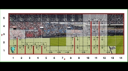

# Lost in a maze

Reeborg's World: https://reeborg.ca/reeborg.html

Reeborg was exploring a dark maze and the battery in its flashlight ran out.

Write a program using an `if/elif/else` statement so Reeborg can find the exit. The secret is to have Reeborg follow along the right edge of the maze, turning right if it can, going straight ahead if it can’t turn right, or turning left as a last resort.

## Hurdle Jumping

